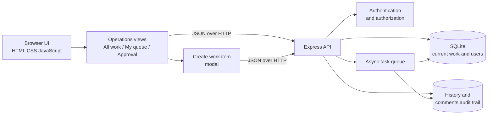

# Newtonite Operations Console

This project is a compact full-stack implementation of the Newtonite Software Engineering Challenge. It models an internal operations app for work items, team ownership, history tracking, authorization, and concurrent update handling.

## Features
- Work item creation and tracking
- Role-based permissions for admins, team leads, analysts, and viewers
- Work item history and comments
- Optimistic concurrency via version checks
- Search and filtering by status, priority, and text
- Workflow views for all work, personal queue, and approval-required items
- Create-work-item modal with team, owner, priority, and context fields
- Asynchronous processing queue for secondary work
- Seeded demo users and sample work items

## Architecture

The application uses a small, layered full-stack design that keeps the primary work-item operation synchronous while moving secondary processing to an asynchronous task queue.



### Main components

- `public/` contains the browser UI. It loads dashboard data, applies search and filters, submits mutations, and refreshes after server decisions.
- `src/app.js` contains the HTTP API, authentication sessions, role checks, resource-level authorization, validation, and error responses.
- `src/db.js` contains the SQLite schema and data-access operations for users, work items, comments, history, and async tasks.
- `server.js` seeds the local database and starts the Express server.

The main browser workflow is organized around an operations board. Users can switch between all work, their own queue, and items waiting for approval; select an item to inspect its history; update its status; add a comment; or create a new item when their role permits it.

### Request and consistency flow

1. The browser authenticates through `POST /api/login` and sends the returned session token with subsequent requests.
2. The API authenticates the user and checks permissions against the requested work item before allowing a mutation.
3. Every work-item update includes the version observed by the client. The API rejects stale writes with `409 Conflict` instead of overwriting a newer change.
4. Successful mutations update the work item and append an auditable history record.
5. Secondary work, such as notifications, is stored as a queued async task and processed after the primary response.

Creation is also authorization-protected at the API layer: viewers can read and comment only where permitted, while admins, team leads, and analysts can create work according to the current access rules. The create modal is only a convenience layer; it is not the security boundary.

### Data model

The core tables are:

- `users`: identity, team membership, and role.
- `work_items`: current state, owner, priority, team, due date, and optimistic-lock version.
- `item_history`: append-only record of important actions and state changes.
- `comments`: collaboration messages attached to a work item.
- `async_tasks`: queued, completed, or failed secondary processing.

This separation keeps list queries focused on current work while preserving the full activity history without loading the entire dataset into the browser.

## Challenge coverage

The submission includes the requested review materials:

- Working source code and a browser-accessible application
- Local setup and run instructions below
- Architecture documentation and [ENGINEERING_DECISIONS.md](ENGINEERING_DECISIONS.md)
- Automated tests for authorization, stale updates, and idempotent assignment
- Known limitations documented below

The implementation deliberately covers the challenge's non-trivial correctness cases through backend authorization, optimistic version checks, idempotent repeat assignment, append-only history, and asynchronous task state. It does not attempt to maximize feature count.

## Run locally

1. Install dependencies:
   npm install
2. Start the app:
   npm start
3. Open the browser at:
   http://localhost:3000

To use another port when `3000` is already occupied:

```powershell
$env:PORT=3001; npm start
```

## Demo accounts
- Alice Johnson — alice@newtonite.com — password: secret123
- Brad Chen — brad@newtonite.com — password: secret123
- Chloe Singh — chloe@newtonite.com — password: secret123
- Derek Ortiz — derek@newtonite.com — password: secret123

## Testing
npm test

The automated suite covers login and dashboard access, viewer edit and create restrictions, stale-write rejection, and idempotent duplicate assignment.

## Known limitations
- This is intentionally a focused MVP rather than a production-grade enterprise platform.
- Authentication is session-based in memory and suitable for a demo environment rather than multi-node deployment.
- Async processing is simulated with a single-node queue and local timers.
- The browser is intentionally a focused operations console rather than a full real-time collaboration client; users refresh after server decisions instead of receiving live push updates.
- Each user has one primary team in this MVP. A production version would add a user-team membership table for users who belong to multiple teams.
- Async task failures are recorded, but durable retries and a distributed worker are intentionally outside this one-day implementation.
